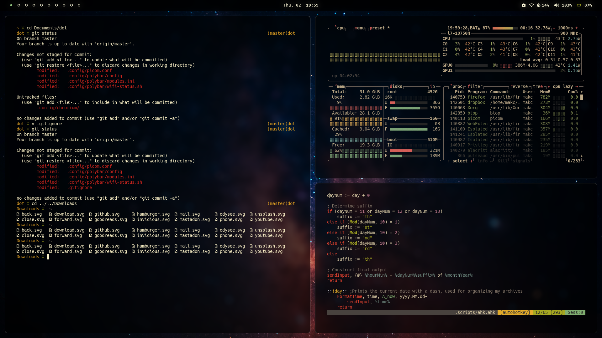

<a href="https://makc.co">
    
</a>

# Dotfiles
These are my dot files. I primarily use [Arch](https://www.archlinux.org), or on occasion [Manjaro](https://manjaro.org). But I do also run [Ubuntu LTS](https://ubuntu.com/) andior [Fedora Workstation](https://fedoraproject.org/workstation/) from time to time, so I also try to make sure my dotfiles work there as well. The same thing is also true of [FreeBSD](https://www.freebsd.org/), which I also have been known to daily drive for brief periods, but in no way do I put a ton of effort into ensuring my configs work there as well. My primary use case is writing, some light web design and the general scripting and hacking that comes with using Window Managers and light-weight systems, so I do tend to keep things as minimal and performant as possible.

**Note**: *There are some [OSX](https://www.apple.com/os/macos/) and [Windows](https://support.microsoft.com/en-us/welcometowindows) specific configs here as as well, but I use something other than Linux or BSD about once a year when I absolutely have to. These configs, only get updated on the rare occasion that I happen to use them, and find an issue that needs to be fixed.*

**The main things here are:**
1. My [Neovim](https://neovim.io/) configuration. 
2. My [Zsh](https://www.zsh.org/) configuration.
3. My window manager configuration, usually [BSPWM](https://github.com/baskerville/bspwm) or [DWM](https://dwm.suckless.org/) these days, though I also have used [Awesome WM](https://awesomewm.org/) in the past.
4. My [Alacritty](https://github.com/alacritty/alacritty) configuration.
5. My [Polybar](https://polybar.github.io/) configuration.



### Usage 
Typically I use a `git clone` to pull down my dot files into the `~/Documents` folder, or some other convenient location and then use symbolic links to have things end up in the right place: 
<details>
<summary>Step by step guide</summary>
    
1. Change directory into a convenient location
```
cd ~/Documents
```
2. Git clone the repo
```
git clone https://github.com/makccr/dot
```
or 
```
git clone --depth 1 https://github.com/makccr/dot
```
3. Move back into home directory
```
cd 
```
4. Set up symbolic links 
```
ln -sf ~/Documents/dot/.config .
ln -sf ~/Documents/dot/.scripts .
ln -sf ~/Documents/dot/.gitconfig .
ln -sf ~/Documents/dot/.zshenv .
ln -sf ~/Documents/dot/.tmux.conf .
ln -sf ~/Documents/dot/.Xresources .
ln -sf ~/Documents/dot/.xbindkeysrc .
```
**Note**: I've also built a little script to automate this process that I store in the `.scripts` folder. It makes the symbolic process take about 0.36 seconds: 
```
./~/Documents/.scripts/setup.sh
```

</details>
